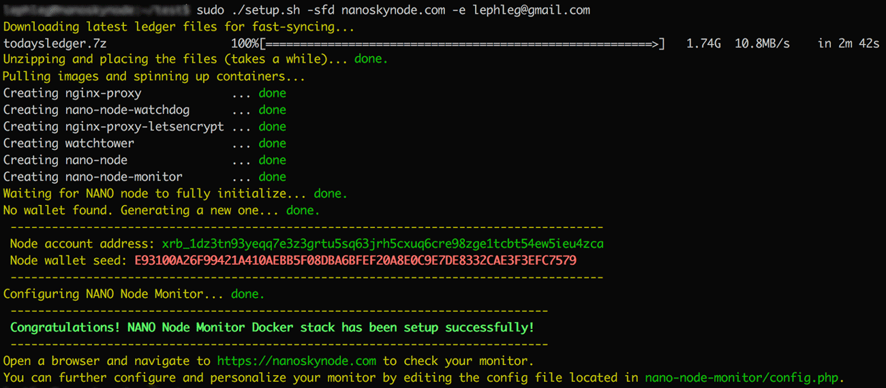

# NANO Node Docker stack (SSL support)

### **Description**

This will build and deploy the following containers on your Docker host:

* **nano-node** -- This is the official NANO node created from the official [NANO Docker Image](https://hub.docker.com/r/nanocurrency/nano/) (RPC is enabled but not publicly exposed).
* **nano-node-monitor** -- This is the popular NANO Node Monitor PHP application based on [NanoTools's Docker image](https://hub.docker.com/r/nanotools/nanonodemonitor/).
* **nano-node-watchdog** -- This is custom lightweight watcher container checking on node's health status every hour (checking code adapted from [dbachm123's nanoNodeScripts](https://github.com/dbachm123/nanoNodeScripts)).
* **watchtower** -- A process for watching your Docker containers and automatically restarting them whenever their base image like the NANO Node is upgraded.

#### **SSL Support with Let's Encrypt**

Optionally, if a domain name is available for the host, NANO Docker Stack can also serve NANO Node Monitor through an secure connection (HTTPS). If this feature is enabled (using the `-d` argument with the setup script below), the stack also includes the following containers:

* **nginx-proxy** -- An instance of the popular Nginx web server running in a reverse proxy setup, serving as a gateway for all incoming requests to your host.

* **nginx-proxy-letsencrypt** -- A lightweight companion container for the nginx-proxy. It allows the creation/renewal of Let's Encrypt certificates automatically.

### **Quick Start**

Open a bash terminal and fire up the installation script:

```
$ ./setup.sh -s 
```

**That's it!** You can now navigate to your host IP to check your Nano Node Monitor dashboard.

#### **Install with SSL enabled**

Open a bash terminal and fire up the installation script with the domain (-d) argument:

```
$ ./setup.sh -sd mydomain.com -e myemail@example.com
```

The email (-e) argument is optional and would used by Let's Encrypt to warn you of impeding certificate expiration.



**Done!** Navigate to your domain name to check your Nano Node Monitor Dashboard over HTTPS!

#### **Install with fast-syncing** (BETA)

NANO Node Docker stack can also bootstrap any newly setup node with the latest ledger files if you're willing to. The latest ledger files are obtained from NANO Node Ninja link [here](https://nanonode.ninja/api/ledger/download).

**Warning:** Be warned, fast syncing will overwrite _any existing wallet_ on your node. Be sure to have your wallet seed securelly stored before running the following command. After the installation is finished you should manually import your seed again.

Just add the `-f` flag to your installer command:

```
$ ./setup.sh -f
```

### Self-configurable Installation

Please check the [wiki](https://github.com/lephleg/nano-node-monitor-docker-stack/wiki)
 for more detailed instructions on how to self-configure the NANO Node Docker Stack.

### **Credits**

* **[Nanocurrency](https://github.com/nanocurrency/raiblocks)**
* **[NANO Node Monitor](https://github.com/NanoTools/nanoNodeMonitor)**
* **[nanoNodeScripts](https://github.com/dbachm123/nanoNodeScripts)**
* **[jwilder/nginx-proxy](https://github.com/jwilder/nginx-proxy)**
* **[JrCs/docker-letsencrypt-nginx-proxy-companion](https://github.com/JrCs/docker-letsencrypt-nginx-proxy-companion)**
* **[v2tec/watchtower](https://github.com/v2tec/watchtower)**
